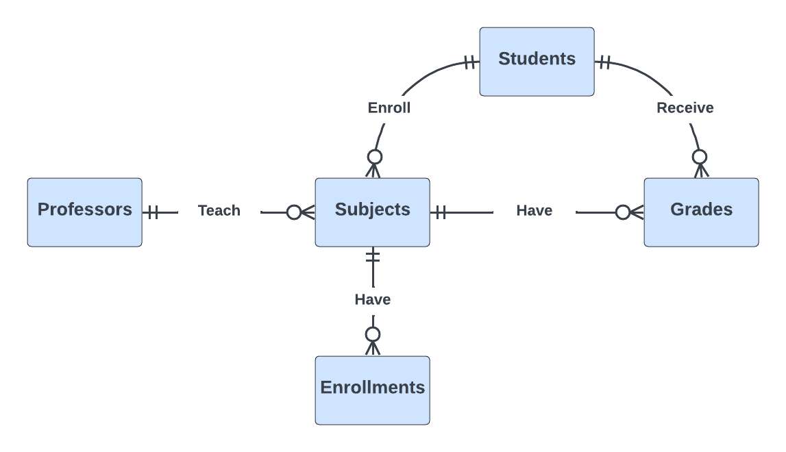

# Design Document

By Gabriel De León Lizardo

Video overview: 

## Scope

The purpose of the database is to manage information related to a university, including students, professors, subjects, enrollments, and grades. It facilitates the tracking of student enrollment, academic performance, and the association of students with subjects and professors.

* Students, including basic identifying information.
* Professors, including basic identifying information.
* Subjects, which includes basic information about the subjects.
* Enrollments, which includes information about student enrollment in subjects.
* Grades, which includes students' grades in particular subjects.

Administrative aspects directly related to student enrollment, subjects, and academic performance.

## Functional Requirements

* Perform CRUD operations on students, professors, subjects, enrollments, and grades.
* Track student enrollment in subjects.
* Record and retrieve grades for students in specific subjects.

## Representation

### Entities

The database includes the following entities:

#### Students

The `students` table includes:

* `id`, which specifies the unique ID for the student as an `INTEGER`. This column thus has the `PRIMARY KEY` constraint applied.
* `first_name`, which specifies the student's first name as `TEXT`, given `TEXT` is appropriate for name fields.
* `last_name`, which specifies the student's last name. `TEXT` is used for the same reason as `first_name`.
* `birth_date`, which specifies when the student was born. Timestamps in SQLite can be conveniently stored as `NUMERIC`, per SQLite documentation at <https://www.sqlite.org/datatype3.html>. The default value for the `birth_date` attribute is the current timestamp, as denoted by `DEFAULT CURRENT_TIMESTAMP`.
* `address`, which is an `TEXT` specifying the student's address.
* `email`, which specifies the student's email. `TEXT` is used for the same reason as `first_name`. A `UNIQUE` constraint ensures no two students have the same email.
* `phone_number'`, which is an `INTEGER` specifying the student's phone number.

All columns in the `students` table are required and hence should have the `NOT NULL` constraint applied. No other constraints are necessary.

#### Professors

The `professors` table includes:

* `id`, which specifies the unique ID for the professor as an `INTEGER`. This column thus has the `PRIMARY KEY` constraint applied.
* `first_name`, which specifies the professor's first name as `TEXT`, given `TEXT` is appropriate for name fields.
* `last_name`, which specifies the professor's last name. `TEXT` is used for the same reason as `first_name`.
* `academic_title`, which is an `TEXT` specifying the professor's title.
* `email`, which specifies the professor's email. `TEXT` is used for the same reason as `first_name`. A `UNIQUE` constraint ensures no two professor have the same email.
* `phone_number`, which is an `INTEGER` specifying the professor's phone number.

All columns in the `professor` table are required and hence should have the `NOT NULL` constraint applied. No other constraints are necessary.

#### Subjects

The `subjects` table includes:

* `id`, which specifies the unique ID for the subject as an `INTEGER`. This column thus has the `PRIMARY KEY` constraint applied.
* `subject_name`, which specifies the subject's name as `TEXT`, given `TEXT` is appropriate for name fields.
* `subject_code`, which is the code of the subject set as `TEXT`.
* `description`, which is an `TEXT` specifying the subject's description.
* `credits`, which is an `INTEGER` specifying the number of the credits of which the subject.
* `professor_id`, which is an `INTEGER`, it's a foreign key that refers to the unique identifier of the professor who teaches the subject.

All columns in the `subjects` table are required and hence should have the `NOT NULL` constraint applied. No other constraints are necessary.

#### Enrollments

The `enrollments` table includes:

* `id`, which specifies the unique ID for the enrollment as an `INTEGER`. This column thus has the `PRIMARY KEY` constraint applied.
* `student_id`, which is an `INTEGER`, it's a foreign key that references the unique identifier of the enrolled student.
* `subject_id`, which is an `INTEGER`, it's a foreign key that references the unique identifier of the subject in which the student enrolls.
* `enrollment_date`, which specifies when the student enrolled the subject. Timestamps in SQLite can be conveniently stored as `NUMERIC`, per SQLite documentation at <https://www.sqlite.org/datatype3.html>. The default value for the `started` attribute is the current timestamp, as denoted by `DEFAULT CURRENT_TIMESTAMP`.
* `status`, which is an `INTEGER` specifying whether the student's status in a particular subject.

All columns in the `enrollments` table are required and hence should have the `NOT NULL` constraint applied. Another constraint is `CHECK` in the column `status` for limit the opcions to `registered` or `withdraw`.

#### Grades

The `grades` table includes:

* `id`, which specifies the unique ID for the grade as an `INTEGER`. This column thus has the `PRIMARY KEY` constraint applied.
* `student_id`, which is an `INTEGER`, it's a foreign key that references the unique identifier of the student who received the grade.
* `subject_id`, which is an `INTEGER`, it's a foreign key that references the unique identifier of the subject for which the grade is assigned.
* `grade`, which is an `INTEGER` specifying the grade in the particular subject to particular student.
* `grade_date`, which specifies when the grade was placed. Timestamps in SQLite can be conveniently stored as `NUMERIC`, per SQLite documentation at <https://www.sqlite.org/datatype3.html>. The default value for the `started` attribute is the current timestamp, as denoted by `DEFAULT CURRENT_TIMESTAMP`.

All columns in the `grades` table are required and hence should have the `NOT NULL` constraint applied. No other constraints are necessary.

### Relationships

The below entity relationship diagram describes the relationships among the entities in the database.

* One student can enroll in 0 to many subjects. 0 if they have not enrolled in any subjects, and many if they enroll in multiple subjects. An enrollment is made by one and only one student for a specific subject.
* A subject can have 0 to many enrollments. 0 if no students have enrolled in that subject, and many if multiple students are enrolled in the same subject.
* A student can receive 0 to many grades. 0 if the student has not received any grades, and many if the student receives grades for multiple subjects. A grade is associated with one and only one student for a specific subject.
* A subject can have 0 to many grades. 0 if no students have received grades for that subject, and many if multiple students have received grades for the same subject.
* A professor can teach 0 to many subjects. 0 if the professor is not teaching any subjects, and many if the professor is teaching multiple subjects. A subject is taught by one and only one professor.
* A subject is associated with one and only one professor. At the same time, a professor can teach 0 to many subjects: 0 if the professor is not teaching any subjects, and many if the professor is teaching multiple subjects.

## Optimizations

Indexes and Views were created on columns commonly used in queries to speed up search operations.

## Limitations

Assumes a traditional education model with individual students, professors, and subjects. Does not support complex scenarios such as group enrollments or collaborative subjects.
